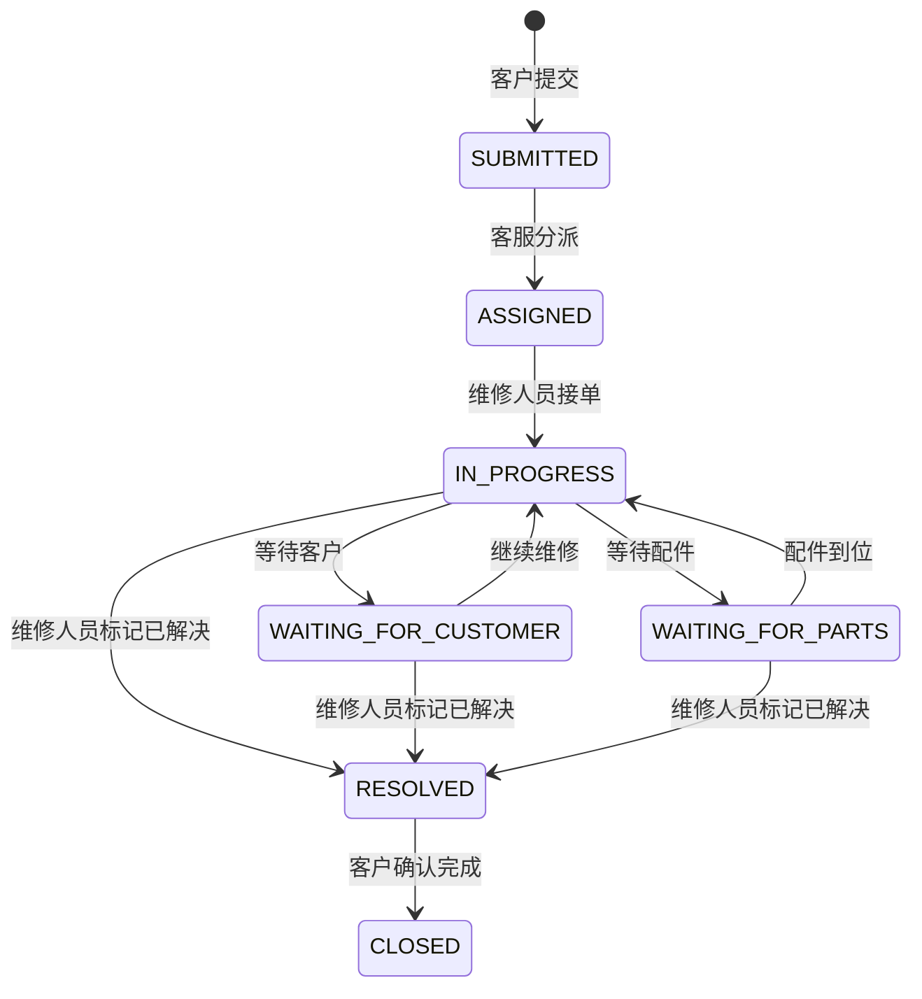

# 修伴 · 在线报修工单平台

一个可独立运行的中文 Spring Boot Web 项目，用来展示从客户报修、客服分派、维修处理到客户确认完成的完整工单流程。项目包含账号与角色权限、工单评论、不可变更的状态历史、联系方式按角色展示、数据库迁移、容器配置和 CI 安全分析。

> 面向本地演示与 GitHub 展示。当前没有托管的公网实例；不要向演示环境提交真实住址、电话或其他敏感信息。

## 功能一览

- **客户**：注册客户账号，创建工单、查看和评论自己的工单，确认已解决的工单。
- **客服**：浏览工单队列，查看脱敏信息，并将待分派工单分给维修人员。
- **维修人员**：查看分派给自己的工单、更新维修进度并留言。
- **工单轨迹**：详情页按时间显示评论与状态历史；每次状态变化会记录操作者、起止状态、说明和时间。
- **数据持久化**：本机默认使用文件型 H2；Compose 使用 PostgreSQL，Flyway 自动执行数据库迁移。
- **中文服务端页面**：客户工作台、客服队列和维修工作台使用响应式 HTML/CSS，不需要单独的前端构建环境。
- 不提供照片或附件上传，重点展示工单流转。

### 工单状态



## 技术选择

| 组件 | 版本 / 用途 |
| --- | --- |
| Java | 21 LTS |
| Spring Boot | 4.1.1；MVC、Thymeleaf、Security、Validation、JPA |
| PostgreSQL | 18.6；Compose 持久化数据库 |
| H2 | Spring Boot 管理的文件型数据库；本机免安装数据库服务 |
| Flyway | 13.8.0；`src/main/resources/db/migration` 中的版本化 SQL 迁移 |
| Maven Wrapper | 3.3.4，下载并使用 Maven 3.9.16 |

## 快速开始：本机运行

需要安装 JDK 21。无需预装 Maven；Wrapper 会下载固定版本的 Maven。

Windows PowerShell 7：

```powershell
pwsh -ExecutionPolicy Bypass -File .\run.ps1
```

Linux / macOS：

```sh
chmod +x ./mvnw ./run.sh
./run.sh
```

启动后打开 <http://127.0.0.1:8080>。本机数据库写入项目下的 `data/repair-ticket-system.mv.db`，应用重启后保留。

本机模式首次启动时会创建三个仅用于演示的账号：

| 角色 | 邮箱 |
| --- | --- |
| 客户 | `customer@example.test` |
| 客服 | `support@example.test` |
| 维修人员 | `technician@example.test` |

每个账号首次创建时会生成独立随机密码，并只写入启动控制台。请在本机查看、保存临时密码；不要把密码或启动日志发布到公开仓库。已有账号不会在重启时重置密码。也可以在首次启动前设置 `REPAIR_DEMO_CUSTOMER_PASSWORD`、`REPAIR_DEMO_SUPPORT_PASSWORD` 和 `REPAIR_DEMO_TECHNICIAN_PASSWORD` 环境变量自定义密码。公开注册只能创建客户账号。

手动构建与启动：

```sh
./mvnw -B -ntp verify
java -jar target/java-repair-ticket-system.jar --spring.profiles.active=local
```

Windows 可使用 `.\mvnw.cmd -B -ntp verify`，然后通过 `java -jar target\java-repair-ticket-system.jar --spring.profiles.active=local` 启动。

## 使用 Docker Compose 与 PostgreSQL

先复制示例环境文件并填写强随机数据库密码：

```sh
cp .env.example .env
```

编辑 `.env`，至少设置非空 `POSTGRES_PASSWORD`。首次演示也可设置三个 `REPAIR_DEMO_*_PASSWORD`；留空时，应用生成随机密码并写入容器日志。`.env` 已加入忽略规则，不要提交。

```sh
docker compose up --build
```

访问 <http://127.0.0.1:8080>。端口只绑定回环地址；PostgreSQL 数据保存在 Compose 的 `postgres-data` volume 中。停止服务使用 `docker compose down`；保留数据库 volume 可再次启动后继续演示。删除 volume 会永久删除其数据。

反向代理到 HTTPS 后，将 `SESSION_COOKIE_SECURE=true`；本仓库未配置公网 TLS、域名或托管环境。

## 权限与隐私

- 密码使用 BCrypt 哈希保存；客户端输入经过服务端验证；表单写请求启用 CSRF 防护。
- URL 入口和业务服务同时检查角色、工单所有权与维修人员分派关系。
- 客户只可读取自己的工单；维修人员只可读取分配给自己的工单；仅客服可以分派。
- 客户和已分派的维修人员可以看到相关联系资料；客服界面中的电话和地址会脱敏；工单号本身不提供匿名查询入口。
- Session Cookie 设置 HttpOnly 与 SameSite，页面配置 CSP、Referrer-Policy 与禁止 iframe 嵌入；容器以非 root 用户运行。
- `example.test` 邮箱、示例电话和演示姓名均为虚构数据。请勿在演示或 CI 中使用真实个人信息。

本项目用于教学与功能展示。正式对外部署前，仍需结合具体业务设置 HTTPS、反向代理、备份与数据保留策略，并增加登录限流、账号恢复和运维监控等能力。

## 测试与自动化

运行编译、集成测试和可执行 JAR 打包：

```sh
./mvnw -B -ntp verify
```

集成测试覆盖客户注册与 BCrypt、CSRF、跨客户和跨角色访问限制、完整派单及状态流转、评论/历史持久化，以及客服和维修人员看到的联系信息差异。

GitHub Actions 在 `main` 和 Pull Request 上执行 `verify`；CodeQL 扫描 Java；Dependabot 每周检查 Maven 依赖和 Actions 版本。

## 项目结构

```text
src/main/java/io/github/repairticket/   Spring Boot 应用、角色、领域服务与页面控制器
src/main/resources/db/migration/         Flyway SQL 迁移
src/main/resources/templates/            中文 Thymeleaf 页面
src/test/                                Spring MVC 集成测试
compose.yaml                             PostgreSQL 与应用编排
Dockerfile                               多阶段、非 root 容器构建
.github/workflows/                       构建测试与 CodeQL 工作流
docs/target-report.md                    目标与验收标准
docs/implementation-report.md            实际实现、验证和限制
```

原实验的 JDK `HttpServer` 示例 `RepairServer.java` 仍保留在历史包路径中，作为原始实验参考；新平台的启动入口是 `RepairTicketApplication`。

## 许可证

本项目采用 [MIT License](LICENSE)。